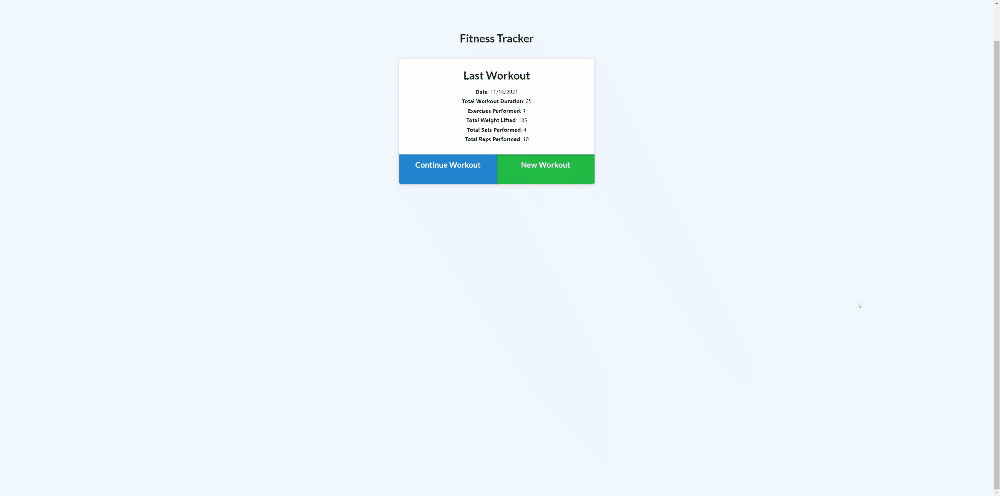

# NOSQL Workout Tracker

## License:

## Table of Contents
1. [Description](#description)

2. [Installation](#installation)

3. [Usage](#usage)

4. [Testing](#testing)

5. [Contribution](#contribution)

6. [Questions](#questions)

## Description 
In this project, I was asked to analyze an application's front-end and reverse engineer the application's back-end using MongoDB and Express.js. The initial starter code consisted of the seeders and public folder, everything else was coded by yours truly. Furthermore, I was asked to deploy the application using MongoDB Atlas and Heroku.

## Installation 
To run the app locally, this project requires users to have Node.js and MongoDB installed on the workbench. After this is complete, you should right click the server.js file, open the integrated terminal, and run the following commands: 

1. "npm install"
2. "npm run seed"
3. "npm start"

Congrats! You have successfully deployed the application locally on your device!

## Usage 
Live Website: https://salty-earth-40487.herokuapp.com/

This product can be used as to log and track workouts on the go. As a user, you are prompted to continue your last workout or create a new once. Given you want to continue a workout, you'll be prompted to add a "resistance" training or "cardio" workout, with the appropriate fields and the app will calculate your running weight, sets, and duration total sfor the workout. Users can also visit the workout dashboard to see visual breakdowns of their recent weight-lifting and cardiovascular training.

## Testing 
This application has no tests.

## Contribution 
The project is expected to be expanded upon following the graduation of the Coding Bootcamp at UT Austin in December of 2021.

## Questions 
Feel free to email me at: alexis.gonzalez07@gmail.com

Visit my Github profile at: [Alex Gonzalez Github](https://www.github.com/AlexisGonzalez07)